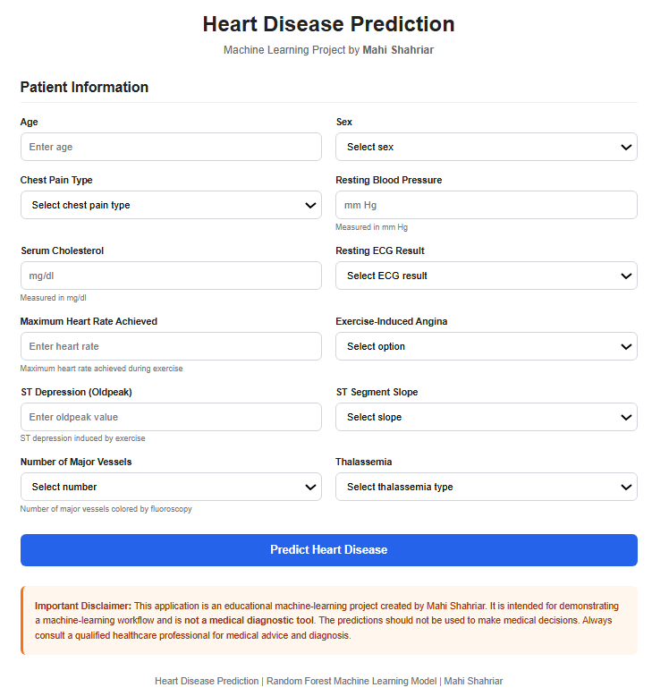

# ❤️ Heart Disease Prediction

An end-to-end machine learning project that predicts whether a patient is likely to belong to the **heart disease** or **no heart disease** class based on clinical features.

The project covers data cleaning, exploratory data analysis, preprocessing, model comparison, hyperparameter tuning, evaluation, and deployment using **Flask**.

ly. It is not a medical diagnostic system and should not be used to make medical decisions.

**Author:** Mahi Shahriar

---

## 📌 Project Overview

The goal of this project was to build and compare several machine learning classification models and select the best-performing one for heart disease prediction.

I trained and tuned **six different models** using `GridSearchCV` with 5-fold cross-validation. After comparing their performance using multiple metrics, **Random Forest** was selected as the final model.

The trained model was then integrated into a **Flask web application** where users can enter patient information and receive a prediction.

---

## 📊 Dataset

The original dataset contains:

* **1,025 rows**
* **14 columns**
* **13 input features**
* **1 target variable**

During data inspection, **723 duplicate rows** were found. After removing duplicates, **302 unique observations** remained.

The `fbs` feature was removed before the final modeling stage based on the feature-selection process used in the project.

---

## 🧾 Features

The final model uses 12 features:

| Feature    | Description                 |
| ---------- | --------------------------- |
| `age`      | Age                         |
| `sex`      | Sex                         |
| `cp`       | Chest pain type             |
| `trestbps` | Resting blood pressure      |
| `chol`     | Serum cholesterol           |
| `restecg`  | Resting ECG results         |
| `thalach`  | Maximum heart rate achieved |
| `exang`    | Exercise-induced angina     |
| `oldpeak`  | ST depression               |
| `slope`    | ST segment slope            |
| `ca`       | Number of major vessels     |
| `thal`     | Thalassemia                 |

### Target

```text
0 → No Disease
1 → Disease
```

---

## 🔎 Exploratory Data Analysis

The EDA included:

* Dataset structure and data types
* Missing-value checks
* Duplicate-value analysis
* Descriptive statistics
* Feature distributions
* Categorical feature analysis
* Target distribution
* Outlier investigation
* Correlation analysis
* Feature relationships with the target

Some numerical features, particularly `chol` and `oldpeak`, showed noticeable skewness and were considered during preprocessing.

---

## ⚙️ Data Preprocessing

Different preprocessing strategies were used depending on the model.

For models that benefit from scaling:

* `PowerTransformer`
* `MinMaxScaler`

For tree-based models such as Random Forest, scaling was not required, so preprocessing was kept as `passthrough`.

The preprocessing workflow was implemented using:

* `Pipeline`
* `ColumnTransformer`

This helped keep preprocessing and model training together and reduced the risk of inconsistent transformations.

---

## 🤖 Machine Learning Models

Six classification algorithms were trained and tuned:

1. Logistic Regression
2. Decision Tree
3. Random Forest
4. K-Nearest Neighbors (KNN)
5. Support Vector Machine (SVM)
6. XGBoost

Each model was tuned using `GridSearchCV` with **5-fold cross-validation**.

The hyperparameter search was performed only on the training data, while the test set was kept separate for final evaluation.

---

## 📈 Model Evaluation

The models were evaluated using:

* Accuracy
* Precision
* Recall
* F1-score
* ROC-AUC
* Precision-Recall Curve
* Average Precision (AP)

I did not rely on accuracy alone when selecting the final model because different metrics provide different perspectives on classification performance.

---

## 🏆 Final Model — Random Forest

Random Forest achieved the best overall performance among the six models.

| Model                |   ROC-AUC | Average Precision |
| -------------------- | --------: | ----------------: |
| 🥇 **Random Forest** | **0.904** |         **0.866** |
| KNN                  |     0.885 |             0.803 |
| SVM                  |     0.871 |             0.775 |
| Logistic Regression  |     0.850 |             0.761 |
| XGBoost              |     0.850 |             0.799 |
| Decision Tree        |     0.725 |             0.693 |

Random Forest achieved the highest **ROC-AUC (0.904)** and **Average Precision (0.866)**.

At a selected threshold corresponding to approximately **0.90 recall**, the model achieved approximately **0.81 precision** on the evaluated data.

---

## 📊 ROC-AUC Curve

The ROC-AUC curve shows how well the models distinguish between the two classes across different classification thresholds.


---

## 📉 Precision-Recall Curve

The Precision-Recall curve shows the trade-off between precision and recall for the positive class.

Random Forest achieved the highest Average Precision score of **0.866**.

**Add your Precision-Recall curve image here:**


---

## 🌐 Flask Web Application

The final Random Forest pipeline was saved using Joblib and integrated into a Flask web application.

Users can enter the required patient information through the web interface and receive a model prediction.

### Application Interface



---

## 👨‍💻 Author

**Mahi Shahriar**

Statistics Student | Machine Learning & Data Science Enthusiast

---

⭐ If you found this project interesting, feel free to explore the notebook and source code to see how the complete machine learning workflow was implemented.
